# Work in progress

# Machine learning Models' performance evaluation

Machine learning(ML) models are algorithms that are trained for a particular set of data. E.g. y = mx + c is an algorithm, whereas y = 2x + 3 is a model. You provide input to a model and it gives a response.
Cognitive systems are not programmed and they perform as per the data on which they are trained on; to sense, predict, infer, and in some ways, think, using artificial intelligence and machine learning algorithms. 

In machine learning world numerous models are being created for achieving a specific task. With so many models available, how can one decide which model to use? Which model is performing better? What are the various performance parameters for different models? This code pattern shows you a way to compare Watson Cognitive services models so as to decide which model performs better for a particular set of data. It provides user a platform to configure models, provide input data, execute and prepare performance evaluation statistics such as [confusion matrix](https://en.wikipedia.org/wiki/Confusion_matrix) and [ROC curve](https://en.wikipedia.org/wiki/Receiver_operating_characteristic).

After going through this code pattern, you should be able to:
- Create and deploy Watson services models
- Configure model evaluation workbench to compare specific models and provide and test data.
- Understand model evaluation parameters and know which model best suits your needs.

## Architecture

1. User launches the application.
2. Cloud authenticates the request and redirects it to the application.
3. Parses input data provided for evaluating the models.
4. Invokes adapter which calls cognitive services like Natural Language Classifier, Natural Language Understanding, etc.
5. Parses the cognitive model services configuration.
6. Connects to cognitive services.
7. Gets response from cognitive services.
8. Compares the expected result with actual result and does performance evaluation.
9. Performance results are sent back to client devices
10. Performance analysis is shown on UI

## Included Components
* [Java Liberty Runtime](https://console.bluemix.net/docs/runtimes/liberty/index.html#liberty_runtime) - Develop, deploy, and scale Java web apps with ease. IBM WebSphere Liberty Profile is a highly composable, ultra-fast, ultra-light profile of IBM WebSphere Application Server designed for the cloud.
* [Natural Language Classifier(NLC)](https://console.bluemix.net/catalog/services/natural-language-classifier) - The Natural Language Classifier service applies cognitive computing techniques to return the best matching classes for a sentence or phrase.
* [IBM Cloud Object Storage](https://console.bluemix.net/catalog/infrastructure/cloud-object-storage): An IBM Cloud service that provides an unstructured/structured cloud data store to build and deliver cost effective apps and services with high reliability and fast speed to market.

## Featured Technologies

* [Liberty for Java](https://console.bluemix.net/docs/runtimes/liberty/index.html#liberty_runtime): Develop, deploy, and scale Java web apps with ease. IBM WebSphere Liberty Profile is a highly composable, ultra-fast, ultra-light profile of IBM WebSphere Application Server designed for the cloud.
* [Aritificial Intilligence](https://www.computerworld.com/article/2906336/emerging-technology/what-is-artificial-intelligence.html): Intelligence demonstrated by machines, in contrast to the natural intelligence displayed by humans.

## Watch The Video
Will be added soon...

## Steps
Follow these steps to setup and run this code pattern. The steps are described in detail below.
1. [Pre-requisites](#1-pre-requisites)
2. [Create the Cognitive models](#2-create-the-cognitive-models)
3. [Deploy the application to the IBM Cloud](#3-deploy-the-application-to-ibm-cloud)
4. [Deploy the application to local machine](#4-deploy-the-application-to-local-machine)
5. [Run the application](#5-run-the-application)
6. [Analyze the Results](#6-analyze-results)

## 1. Pre-requisites
- IBM Cloud account: You must have IBM Cloud account to work with this code pattern. If you do not have an IBM Cloud account, you can create a one month free trail account [here](https://console.bluemix.net/).

## 2. Create the Cognitive models

While we can use any Watson models for the sake of this code pattern, we will use Natural Language Classifier or NLC service. This code pattern requires at least two NLC models to compare and evaluate. So, we will create two instances of the NLC service.

### 2.1 Create NLC service instances:

- Now with the recent changes, NLC instances can be created from watson studio service.
- Login to [IBM Cloud](http://console.bluemix.net/) dashboard 
- Click on Catalog to create a Watson Studio Instance.

- Search for the text `Watson Studio`, click on `Watson Studio` service.
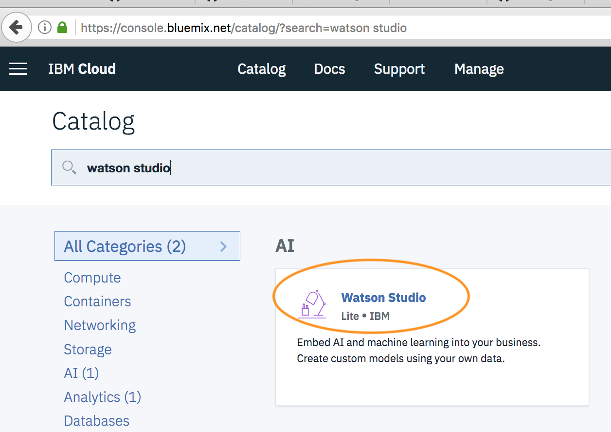
- Provide a appropriate name(here we provided the name as `Watson Studio - ModelEval`) and description.

- Watson Studio instance gets created. Click on Get Started.
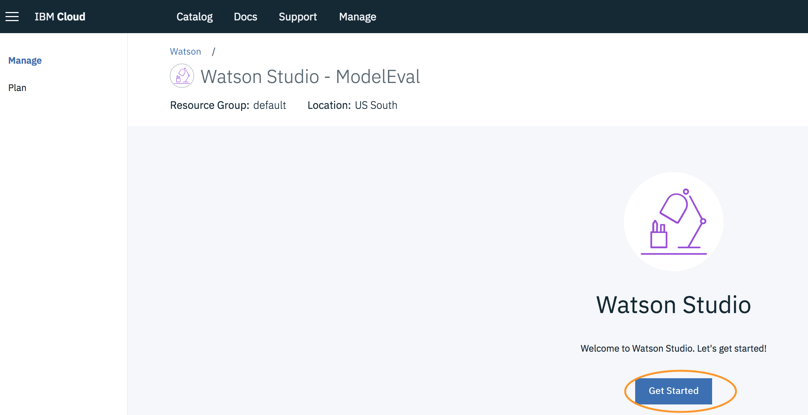
- Watson studio opens up. Click on `New Project`
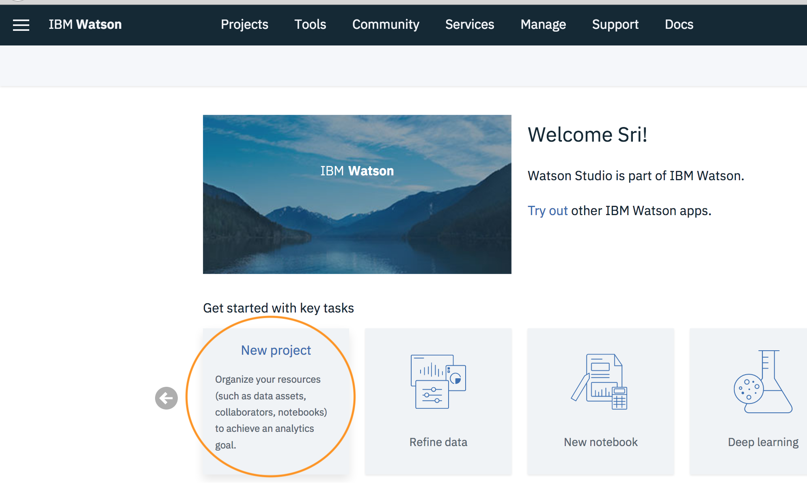
- Select the `Complete` option and then click ok.
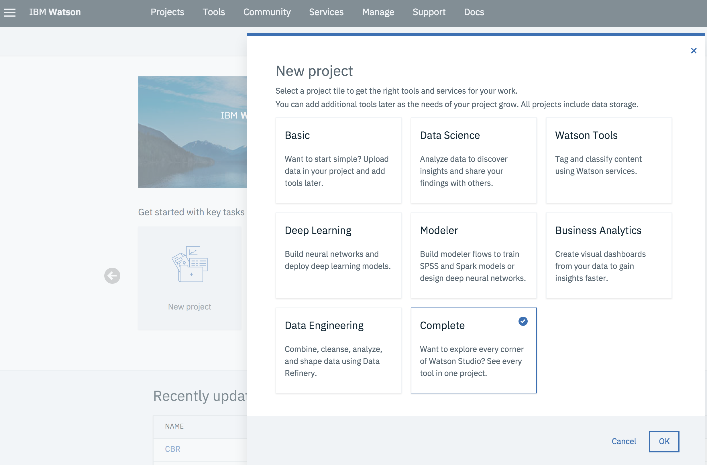
- A `New Project` console will open. Provide project name and description.
- We now require storage service for storing project assets.
- Click on `Cloud Object Storage` link, which will navigate to create a cloud object storage service. 
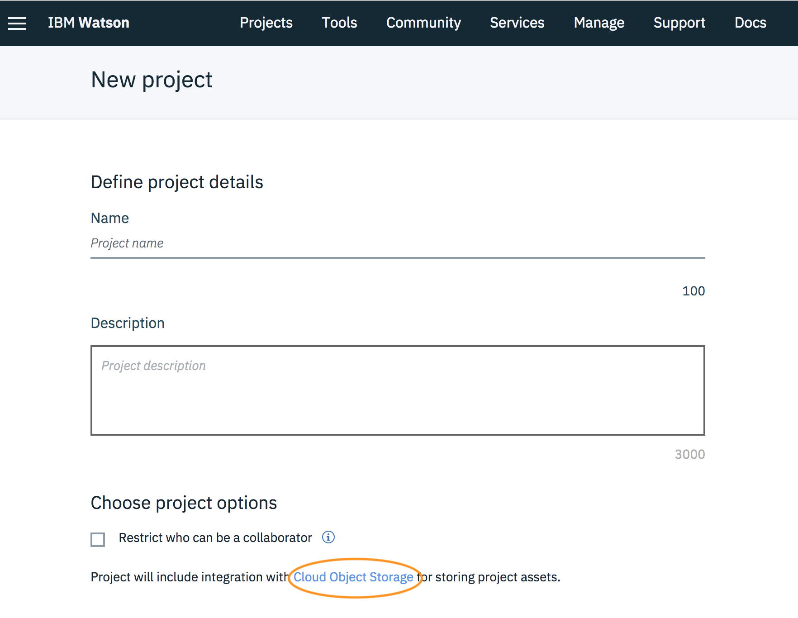
> Note: When creating your Object Storage service, select the ``Free`` storage type in order to avoid having to pay an upgrade fee.
- Once storage service gets created, you will be diverted to the watson studio console. Click on `Assets` tab.
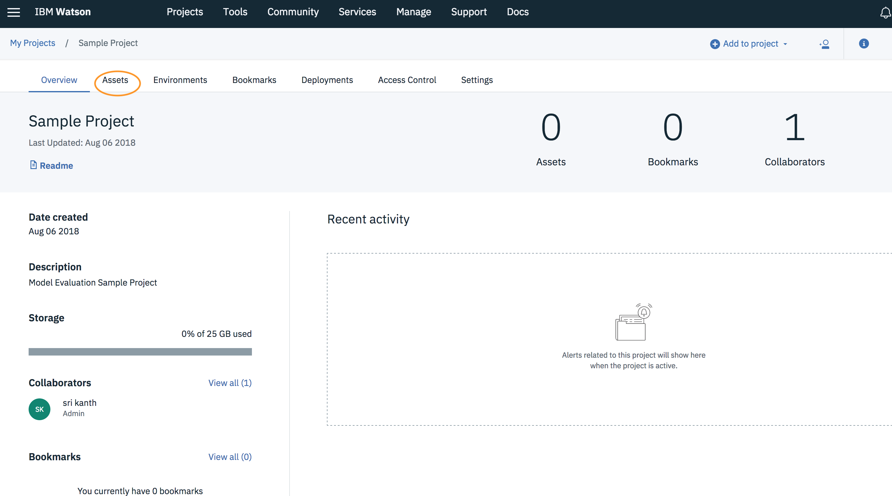
- Under `Models`, click on `New Natural Language Classifier model`
 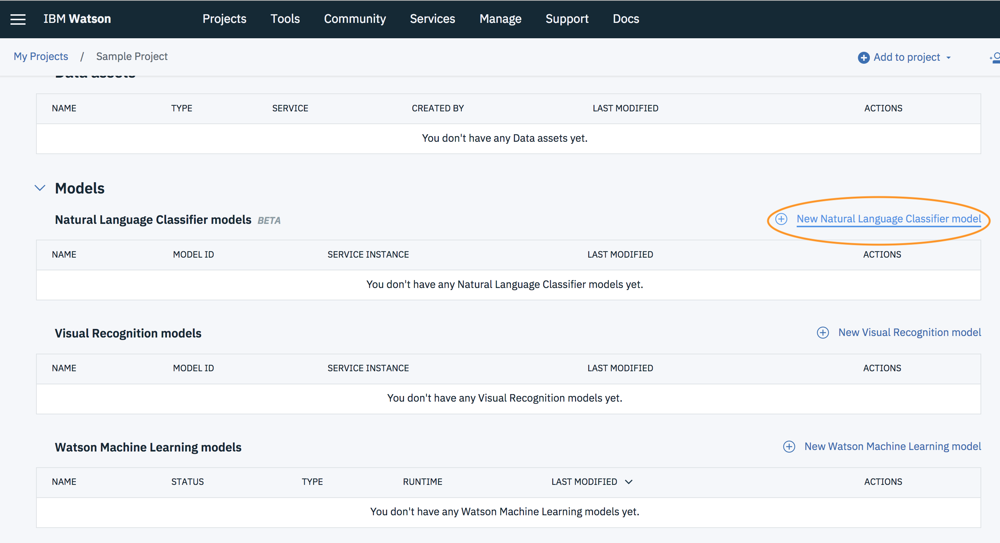
- Click `Create`.

- When the service is created, click `Service Credentials` in the left navigation bar.
- Click `View Credentials` under Actions.
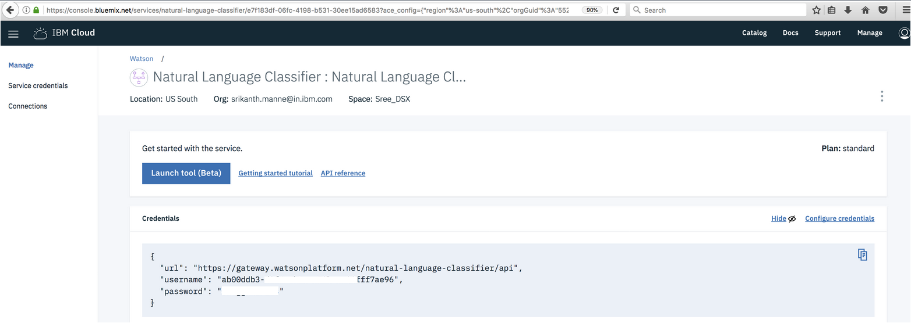
- Copy username, password, and url values and save it as a text file. These credentials are required in later steps.
- Click on `Launch Tool`
- Click `Create Model`
- On the right hand side of the screen there is a browse button. Click on the browse button and select the file `../src/main/data/NLC_import_Training1.csv`
- Click on the checkbox against the file just uploaded.
- Click `Add to model`
- Click `Train Model`
- On the popup Specify model language as english and click `Train`

- To create another NLC model, we can use the same instance of the NLC and click on `Create Model` to create another instance of NLC service.

- Train that model with the file `../src/main/data/NLC_import_Training2.csv`

Now, two sets of model NLC services are trained and ready to be used.

## 3. Deploy the application to IBM Cloud

The application can be deployed on IBM Cloud or locally. Execute Step 3 for deploying on IBM Cloud or Step 4 to deploy locally.

### 3.1 Deploy to IBM Cloud

* Maven should be installed. If not installed, you can download maven from [here](https://maven.apache.org/download.cgi). You can refer to the installation instructions [here](https://maven.apache.org/install.html).
* Install [IBM Cloud CLI](https://console.bluemix.net/docs/cli/reference/ibmcloud/download_cli.html#install_use) if not already done
* Login to IBM Cloud using CLI using `bx login` command. Ensure that the target points to the region and space where you are running and deploying this code pattern.

* open command prompt. Change directory to location where you want to download project files. Go to that directory.
* run `git clone git@github.com:IBM/model-evaluation-workbench.git` to clone the repository
* Change directory to model-evaluation-workbench
* run the command `mvn clean install`
* This should create the file `workbenchModelEval.war` under `target` folder
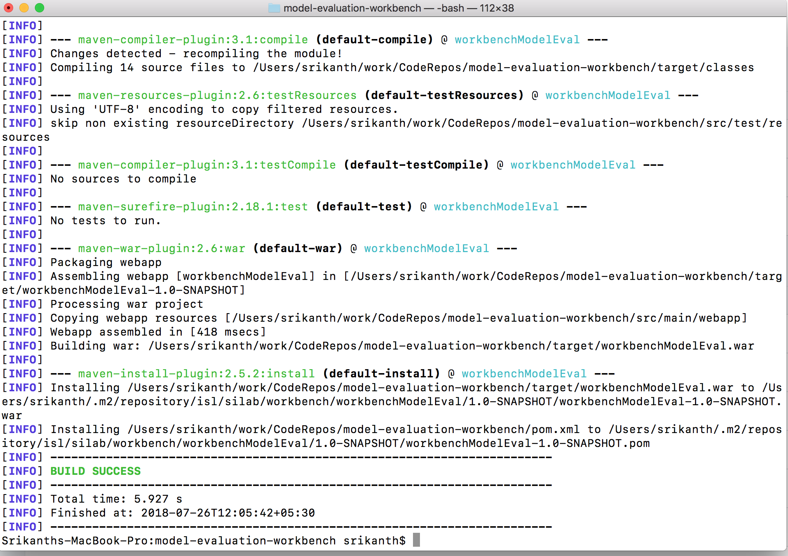
* Open the manifest.yml file and update host to be unique, may be append with your ibm id.
* Push the application to IBM Cloud using the command: `bx cf push <Application_Name>`
* The application should get deployed successfully. If not check the logs to determine the error and fix it.

- Open IBM Cloud Console, Under Dashboard you should see the above deployed application running. Click on the application.

- Click on `Visit App URL` link to launch the application.

### 3.2 Configure the application with the cognitive models

Cognitive Model Evaluation application is now deployed. This application now needs details of the models which it needs to invoke for comparing various models.
* Go to IBM Cloud Console
* Click on the application that was deployed in previous step
* Click on Runtime and then click on Environment variables.
* Under `User defined` section Click on `Add`
* Under `Name` enter `NLC_USERNAME_CONFIG_1` and under value pass the username of the first NLC service instance that was created in section [Create NLC service instance](#21-create-nlc-service-instances)
* Click on Save.
* Repeat above steps for adding `NLC_PASSWORD_CONFIG_1`, and `NLC_CLASSIFIER_ID_CONFIG_1`
* Add second NLC service instance details as `NLC_USERNAME_CONFIG_2`, `NLC_PASSWORD_CONFIG_2` and `NLC_CLASSIFIER_ID_CONFIG_2`.

Skip Step 4 and Go to Step 5 to Run Application.

## 4. Deploy the application to local machine

The application can be deployed on IBM Cloud or locally. Execute Step 3 for deploying on IBM Cloud or Step 4 to deploy locally.

### 4.1 Clone git repository
* open command prompt. Change directory to location where you want to download project files. Go to that directory.
* run `git clone git@github.com:IBM/model-evaluation-workbench.git` to clone the repository
* Change directory to model-evaluation-workbench

### 4.2 Deploy to local machine
- If eclipse is not installed on your local machine then install Eclipse following instructions provided in this [link](https://www.eclipse.org/downloads/)
- After the installation, launch Eclipse
- In the eclipse menu, click `file` and then click `import`
- Under import wizard, expand `General` folder and select `Existing Project into Workspace`.
- Click `Next` and browse to the cloned project folder.
- Click the `Finish` button.
- Setup Liberty server in eclipse as per this [Link](https://www.ibm.com/blogs/bluemix/2016/05/liberty-and-eclipse-create-server-p10/)
- Application needs to access models to send requests to and get responses from them. Access details of these models have to be provided in server config (server.env) file of liberty server. A sample server.env file snapshot is as in below image. You will need to provide the credentials of the models. You can access NLC credentials as described in section `Create NLC service instance`

- Start the Liberty Server

- Right Click on the Liberty Server created above, Click on the `Add and Remove`
- Under Add and Remove wizard, from the available section move `ModelEvaluationWorkbench` to configured section.
- Click on Finish.
- Model Evaluation application should be started.
- In Eclipse, under Console tab, you will see default_host link similar to http://localhost:9091/ModelEvaluationWorkbench/. Click on that link to launch the application.

## 5. Run the Application

We created two models using Natural Language Classifier. Now, we would evaluate which model is performing better when compared to each other.

- On the application home page click on `NLC` box
- Under `Attribute` select `Classes`

- Select `MODEL 1` and `MODEL 2` checkboxes
- Two browse buttons will be available since we have selected two models. Click on each browse button and select the file `src/main/data/NLC_import_Truth.csv` from your git repo. The same file is selected for both browse buttons because this file is the actual results file which needs to be compared with both the model results.
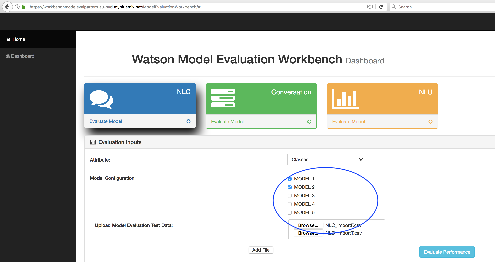
-	Step5: Click on Evaluate Performance button.
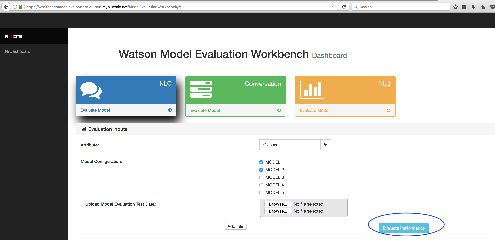

The application invokes both the NLC services, gets responses and displays various evaluation parameters.

## 5. Analyse results

The result shows a lot of statistical data for model performance evaluation. It is suggested that you become familiar with these [terminologies](https://console.bluemix.net/docs/services/watson-knowledge-studio/evaluate-ml.html#evaluate-ml)

Results of running the two NLC models using the truth file enables the application to check how the results from each of the models are faring.

The below screenshot shows various parameters such as `F1Score Optimization` and `Accuracy Optimization` and also provides `Model Rating`

The application also shows ROC chart, for both the models, for various parameters
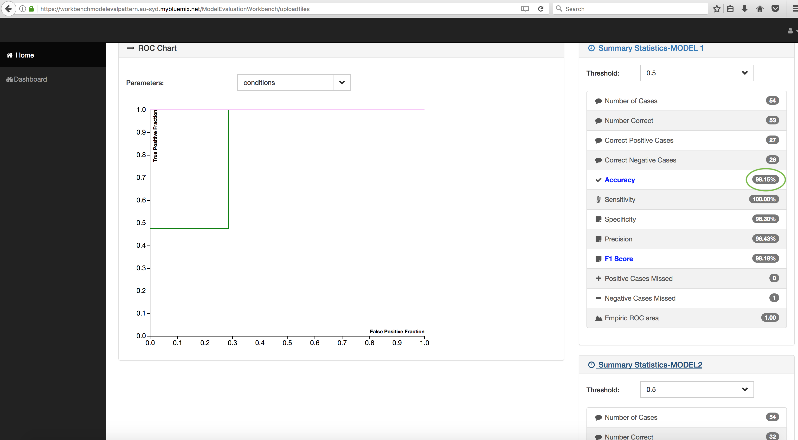

In this case we can see that Model 1 fares better compared to model 2. Users can analyse various performance parameters and can take approriate decision

## 6. Links
- [Artificial Intelligence](https://www.ibm.com/services/artificial-intelligence)
- [Analyzing machine learning model performance](https://console.bluemix.net/docs/services/watson-knowledge-studio/evaluate-ml.html#evaluate-ml)

## 7. Learn More
- [Natural Language Classifier](https://console.bluemix.net/catalog/services/natural-language-classifier)
- [Natural Language Understanding](https://console.bluemix.net/catalog/services/natural-language-understanding)
- [Watson Assistant](https://console.bluemix.net/catalog/services/watson-assistant-formerly-conversation)

## 8. License
[Apache 2.0](LICENSE)
